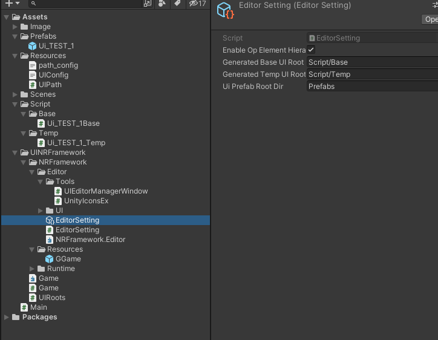
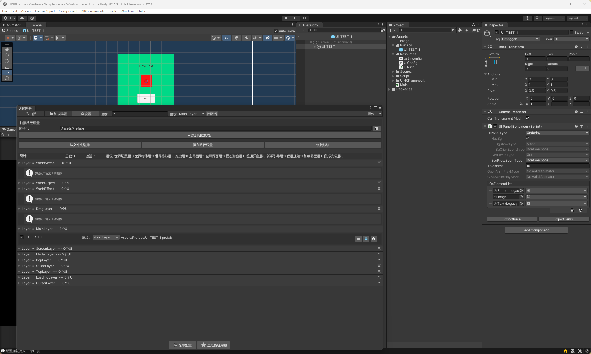
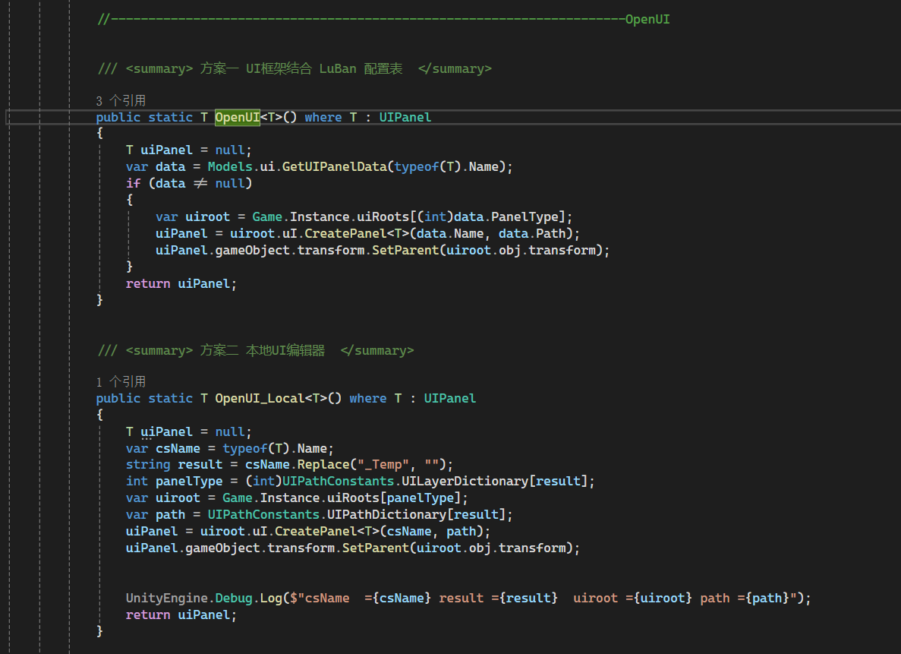
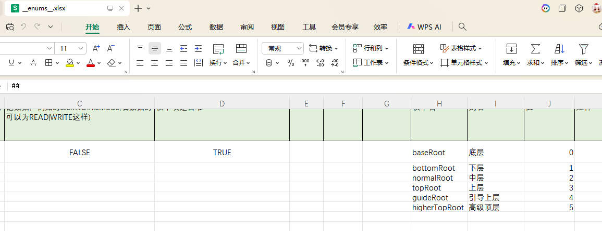

# NRFramework.UISystem
基于NRFramework.UI 框架 增加自定义编辑器，小魔改源码增加需求方法，支持本地操作和Luban导表双重配置，同时也支持两种模式结合使用，支持一键生成UI框架层级配置，支持一键导出代码，配置UI效果表现。等相关功能
### 链接
- [UINRFramwork文档](https://blog.csdn.net/NRatel/article/details/127902181)
- [gitHub原工程链接](https://github.com/NRatel/NRFramework.UI)

### 配置导出路径预，Base  Temp  Prefabs制体路径
- 修改： Root预制体GGame，初始化一键生成UI 框架层级模块。
- 修改： 增加UI编辑器功能方便快捷开发。
- 修改： 增加源码并未监听重要的相关功能。

### NRFramework UI编辑器
- 通过Unity项目 Tools--UI管理打开
- 扫描 ：筛选出UI预制体 剔除 wight 组件 在UIPanel 上需要挂架NRFramework 的 UIPanelBehaviour
- 加载配置： 加载已经配置好的数据 例 : UI 层级 路径 等
- 设置：配置搜集预制体路径（支持多个路径）
- 预制体上 可以通过 “层级” 修改加载后父物体UILayer层级 点击下面两个按钮保存UI配置
- 导出代码等 参考NRFramework.UI 官方文档我会贴在上面

### 打开界面支持 luban 配置 和本地配置

- 一个完全由本地编辑器控制，一个完全由luban 配置表驱动
- 从一个函数方法不难看出，配置表驱动，需要名字，路径 层级 等基础信息
- 同时当我们做界面跳转功能，功能需求可以让策划配置，同时我们可以走本地编辑器，两种模式结合使用，策划不需要陪路径层级等基础信息，能够减轻开发繁琐流程。
- 同时这套UI框架，可以适配 YooAssets  Luban  HybridCLR 等多种开发工具.
### 代码源文件修改
- 源代码中并未支持Update，后台挂机，返回游戏等相关函数
- 修改后，支持这些功能，手动控制Update是否 使用。避免了update滥用 同时 也能够在极端特殊情况下必须使用Update的需求
- 可以去我的博客看基于Unitask 下写的计时器结合使用
- 其他更多修改可以根据自己的项目，手动添加，修改。

