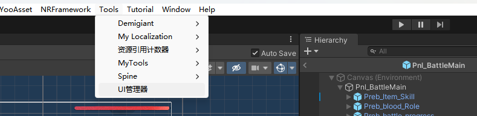
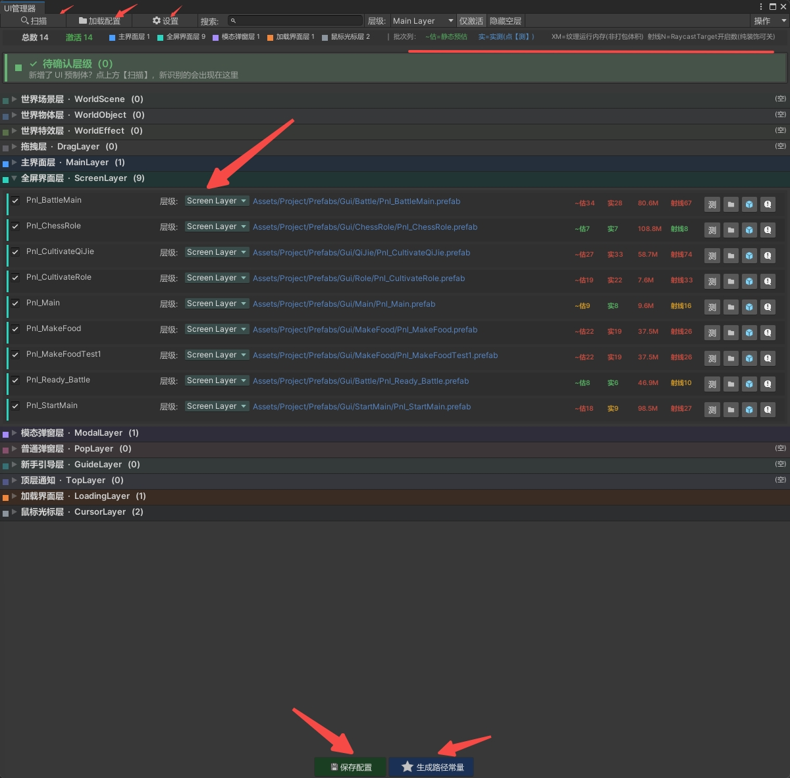
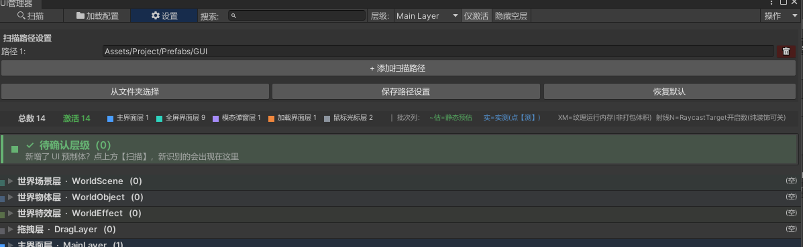
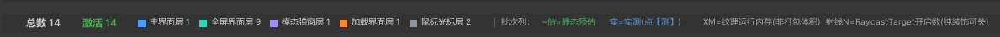
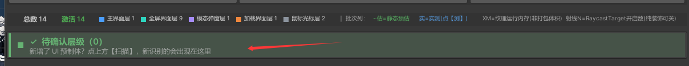
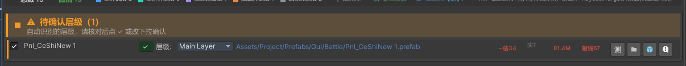
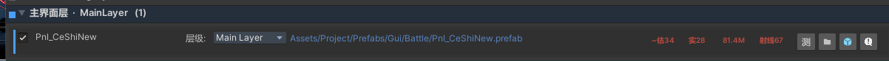
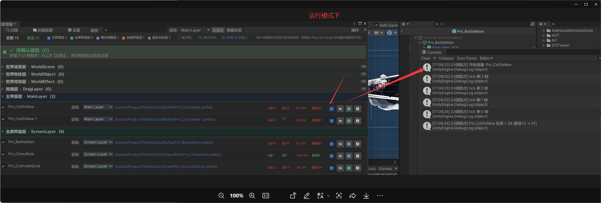
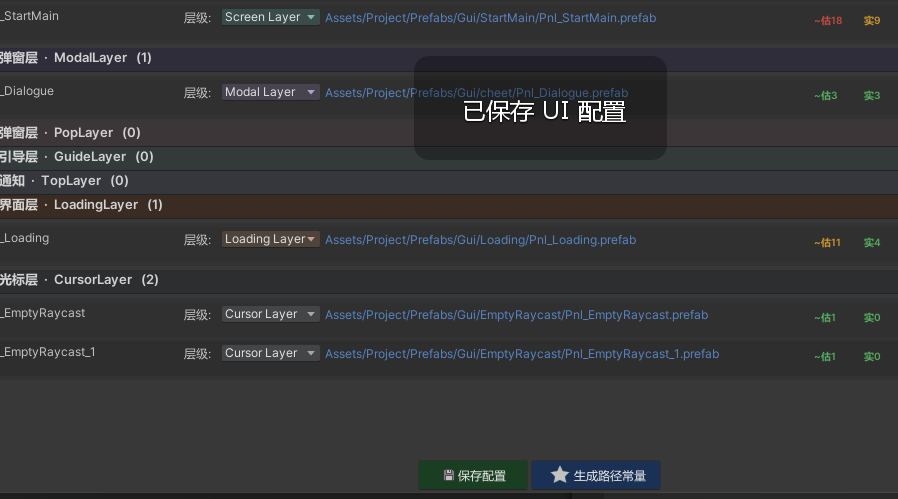
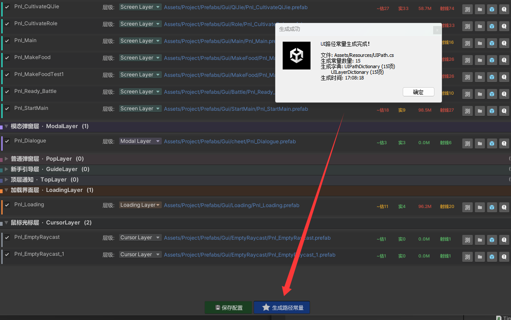

# NRFramework.UISystem
- 基于NRFramework.UI 框架
- 支持本地操作和Luban导表双重配置（以本地UI编辑器为主），支持两种模式结合使用。
- 支持一键生成UI框架层级配置
- 支持一键导出代码，配置UI效果表现。等相关功能
- 支持一键配置对象元素，数据和UI逻辑分离。
- 支持多rootUI 组管理。
- 新增cloneWidget,支持多个wid生成，
- 新增UI编辑器
- 新增编辑器功能（待确认区/批次估实测/内存/RaycastTarget体检）
- 新增商业化功能接口，魔改源码。
- 新增UI编辑索引，和管理功能。
- 新增大型项目层级设计
- 新增代码定位
- 新增判断UI是否展开功能
### 链接
- [UINRFramwork文档](https://blog.csdn.net/NRatel/article/details/127902181)
- [gitHub原工程链接](https://github.com/NRatel/NRFramework.UI)

# NRFramework.UISystem

一套基于 [NRFramework.UI](https://github.com/NRatel/NRFramework.UI) 扩展的 Unity UI 框架，
提供 **12 层级管理 + 面板/组件生命周期 + 代码自动生成 + UI 编辑器体检工具**。
资源走 YooAsset，配置支持本地编辑器 + Luban 双通道。

---

## ✨ 特性
- **12 层 UIRoot 层级体系**：世界层 → HUD → 全屏 → 弹窗 → 引导 → 加载 → 光标，sortingOrder 自动分配。
- **面板(Panel)/组件(Widget) 统一生命周期**：Create → BindComps → Created → Enable → Destroy。
- **一键生成绑定代码**：预制体标记节点 → 生成 Base 类(自动绑 `m_xxx` 字段和事件)。
- **UI 编辑器工具**：扫描预制体、可视化配层级、生成路径常量，并做**批次/内存/RaycastTarget 体检**。
- **焦点 & ESC 返回** 自动管理。

---

## 🧩 环境依赖
- Unity（UGUI）
- **YooAsset**（资源加载）
- **Luban**（可选，配表导出）
- **HybridCLR**（可选，热更）

---
## 🛠️ UI 管理器编辑器 · 详细用法

一个可视化面板：**扫描所有 UI 预制体 → 配层级 → 生成路径常量**，并对每个界面做**批次/内存/RaycastTarget 体检**，帮你日常管理和优化 UI。

### 打开
菜单栏 **Tools ▸ UI管理器**。首次打开会自动加载已存配置(或自动扫描)。

> 📸 

---

### 一、界面分区总览
从上到下：**工具栏 → (设置面板) → 统计栏 → 待确认区 → 层级列表 → 底部按钮**。

> 📸 

---

### 二、顶部工具栏
| 按钮 | 作用 |
|---|---|
| 🔍 **扫描** | 扫描配置路径下所有带 `UIPanelBehaviour` 的预制体，自动识别层级，带进度条，完成弹窗 |
| 📂 **加载配置** | 重新读取已存的 UIConfig（手动点会浮层提示"已加载 N 个"）|
| ⚙ **设置** | 展开/收起"扫描路径设置"面板（选中时蓝底高亮）|
| 🔎 **搜索** | 按名称/路径过滤 |
| **层级:** 开关 + 下拉 | 勾上后只显示选中的那一层 |
| **仅激活** | 只显示勾了激活的项 |
| **隐藏空层** | 收起没有内容的层，列表更聚焦 |
| 📋 **操作** | 下拉菜单：全部激活/全部禁用/重置层级/自动排序/展开所有层 |

---

### 三、设置面板（点"设置"展开）
- **扫描路径**：可加多条(`+ 添加扫描路径`)、删除(🗑 红按钮)、从文件夹选择、保存、恢复默认。
- 改完点 **保存路径设置**。

> 📸 

---

### 四、统计栏
- **总数 / 激活**(绿色) 数量。
- **彩色层级 chip**：每个非空层一个带色胶囊，**点击即筛选只看该层**。
- **图例**：`~估=静态预估  实=实测  XM=纹理运行内存  射线N=RaycastTarget开启数`。
- **▶ 当前帧总批次**(仅 Play 模式)：整个 Game 视图实时批次，实测的参考基准。

> 📸 

---

### 五、待确认区（橙色/绿色，常驻顶部）
- **有新识别的界面时**(橙色 ⚠)：列出自动识别层级、还没人工确认的界面。
  - 点每行的绿色 **✓** 确认（层级猜对了），或**改层级下拉**（自动算确认）→ 移入正式层级分组。
- **没有待确认时**(绿色 ✓)：显示引导语"新增了 UI 预制体？点上方【扫描】刷新识别"——提醒你加了预制体就来扫。

> 📸 
> 📸 

---

### 六、每行元素详解
一行 = 一个 UI 预制体：

| 元素 | 说明 |
|---|---|
| ☑ 勾选 | 是否**激活**(参与生成常量)；未激活整行置灰 |
| **名称**(可点) | 点一下在 Project 里选中定位；悬停看层级/路径 |
| **左侧色条** | 该行所属层级的主题色（待确认=橙色）|
| **层级** 下拉 | 改这个界面的层级(染层级色)|
| **路径**(淡蓝) | 可**鼠标划选 → Ctrl+C 复制** |
| `~估N` / `实N` | **预估批次 / 运行时实测批次**(红绿灯着色，悬停看构成) |
| `X.XM` | **纹理运行内存**(红绿灯) |
| `射线N` | **RaycastTarget 开启数**(红绿灯) |
| **测** | Play 模式下实测该界面真实批次 |
| 📁 / 🧊 / 🔍 | 系统文件夹定位 / 打开预制体编辑 / Project 选中 |

> 📸 

---

### 七、体检三指标（怎么看、怎么优化）
| 指标 | 含义 | 红绿灯 | 优化手段 |
|---|---|---|---|
| **批次(估/实)** | 合批后的 DrawCall | ≤8绿 / ≤16黄 / >16红 | 打图集、关多余 RaycastTarget、避免图集交错 |
| **内存 (XM)** | 依赖纹理运行内存(RAM,非打包体积) | <2M绿 / <6M黄 / ≥6M红 | 压缩格式(ASTC/ETC2)、降分辨率、关 Mipmap |
| **射线 (N)** | RaycastTarget 开启的图形数 | ≤8绿 / ≤20黄 / >20红 | 纯装饰/不点击的取消勾选 Raycast Target |

> 说明：**批次估/内存/射线** 都是**静态算、不用打包**；只有 `实N`(实测批次) 需要 Play 模式。

---

### 八、实测真实批次（Play 模式）
1. **进入 Play 模式(▶)**（建议在一个尽量空的场景里，数值最纯净）。
2. 点某行蓝色 **测** 按钮。
3. 工具临时生成该预制体、渲染几帧、读 `UnityStats.batches` 差值 → 写回 `实N`，并浮层提示。

> 注意：实测是"该界面单独、默认内容"的批次，是横向对比基准；真实上下文的批次可对着"▶ 当前帧总批次"手动读差值。

> 📸 

---

### 九、生成路径常量
核对好层级后：
1. 点底部 **保存配置**(浮层提示已保存；有未保存改动时标题会显示 `UI管理器 *`)。
2. 点 **生成路径常量** → 生成 `Assets/Resources/UIPath.cs`(`UIPathConstants` 类)。
   - **会先做重名校验**：若有同名预制体(会导致常量类编译报错)，弹窗列出并中止，先改名再生成。
   - **先执行1 在执行 2**

> 📸 
> 📸 

---

### 十、常见问题
- **关窗口提示"有未保存改动"**：你改了层级/激活没点保存，选保存即可。
- **编译报 `Graphic/Image/Canvas` 找不到**：给 `NRFramework.Editor.asmdef` 加 `UnityEngine.UI` 引用。
- **内存别相加**：共享图集会各行重复计，是运行内存参考、非打包体积。
## 🚀 快速开始

### 1. 初始化框架（启动时调一次）
```csharp
using NRFramework.UI;

// 游戏启动入口调用，之后所有 UIRoot 层级就绪
Game.Instance.Init();
```

### 2. 打开一个面板
```csharp
// 取对应层级的 UIRoot（层级值用生成的 UIPath 常量，见下文）
var root = Game.Instance.uiRoots[UIPathConstants.Pnl_Main_UIlayer].uI;

// 创建面板：泛型=面板逻辑类，参数=预制体路径
root.CreatePanel<Pnl_Main_Temp>(UIPathConstants.Pnl_Main_UIPanel);
```

### 3. 关闭面板
```csharp
root.ClosePanel<Pnl_Main_Temp>();      // 关闭(隐藏并清理)
root.DestroyPanel<Pnl_Main_Temp>();    // 彻底销毁
root.SetPanelVisible<Pnl_Main_Temp>(false); // 只隐藏不销毁
```

> 📸 建议截图：游戏启动脚本里调用 `Game.Instance.Init()`；以及打开某界面的调用处。

---

## 🗂️ 层级体系（12 层 UIRoot）

| 层级 | 枚举值 | 用途 | sortingOrder 段 |
|---|---|---|---|
| WorldScene | 0 | 场景UI：地图标记、地面特效 | 0–49 |
| WorldObject | 1 | 物体UI：血条、名字、NPC标识 | 50–99 |
| WorldEffect | 2 | 特效UI：伤害数字、BUFF图标 | 100–149 |
| DragLayer | 3 | 拖拽层 | 150–199 |
| MainLayer | 4 | 主界面 HUD | 200–249 |
| ScreenLayer | 5 | 全屏功能界面 | 250–349 |
| ModalLayer | 6 | 模态对话框 | 350–449 |
| PopLayer | 7 | 普通弹窗 | 450–549 |
| GuideLayer | 8 | 新手引导 | 550–649 |
| TopLayer | 9 | 飘字/公告 | 650–749 |
| LoadingLayer | 10 | 加载界面 | 750–849 |
| CursorLayer | 11 | 鼠标/手势 | 850–949 |

> 同层内多个面板会自动按 sortingOrder 递增叠放，无需手填。

---

## 🖼️ 制作一个界面（完整流程）

### 第 1 步：做预制体 + 挂行为脚本
- 用 UGUI 拼好界面预制体。
- 根节点挂 **`UIPanelBehaviour`**（Widget 用 `UIWidgetBehaviour`）。

### 第 2 步：标记要绑定的节点
- 选中要在代码里用的节点（按钮/文本/图片…）→ 右键 **`SetAsUIOpElement`** 标记为操作元素。
- 取消标记用 `RemoveUIOpElement`。

### 第 3 步：生成 Base 代码
- 在 `UIPanelBehaviour` 的 Inspector 上点 **生成/导出 Base**，会生成 `Xxx_Base` 类，
  自动把标记的节点绑成 `m_XXX` 字段、并在 `OnBindCompsAndEvents` 里连好事件。

### 第 4 步：写面板逻辑类（继承 Base）
```csharp
public class Pnl_Main_Temp : Pnl_MainBase
{
    protected override void OnCreated()
    {
        // 初始化：m_ 字段已绑好，直接用
        m_Txt_Title_Text.text = "主界面";
    }

    protected override void OnClicked(Button button)
    {
        if (button == m_Btn_Start_Button) { /* 点了开始 */ }
    }

    protected override void OnDestroying() { /* 清理 */ }
}
```

### 第 5 步：打开它
```csharp
Game.Instance.uiRoots[UIPathConstants.Pnl_Main_UIlayer].uI
    .CreatePanel<Pnl_Main_Temp>(UIPathConstants.Pnl_Main_UIPanel);
```

> 📸 建议截图：① 预制体挂 UIPanelBehaviour；② 右键 SetAsUIOpElement；③ 点生成 Base；④ 生成出的 Base 代码；⑤ 写的 _Temp 逻辑类。

---

## 🧱 Widget 用法（CreateWidget vs CloneWidget）

Widget 是"界面里的可复用子模块"（如一个道具格子、一条列表项）。**两个方法用途不同：**

### CreateWidget —— 用**现成节点** / 加载预制体
```csharp
// A. 直接把预制体里已有的一个节点包成 Widget（不复制）
CreateWidget<Wdg_Header_Temp>(m_Header_UIWidgetBehaviour);

// B. 按路径加载一个 Widget 预制体挂到某父节点下
CreateWidget<Wdg_Popup_Temp>("popup", parentTransform, "Assets/.../Wdg_Popup.prefab");
```

### CloneWidget —— 从**模板克隆一份**（列表项最常用）
```csharp
// 拿模板 behaviour，克隆 N 份填列表
for (int i = 0; i < dataList.Count; i++)
{
    var item = CloneWidget<Preb_Item_Temp>("Item_" + i, contentTrans, m_Preb_Item_UIWidgetBehaviour);
    item.Setup(dataList[i]);
}
```

**区别一句话：**
- `CreateWidget(behaviour)` = **包裹现有节点**，不复制（界面里本来就有的模块）。
- `CloneWidget(templateBehaviour)` = **Instantiate 复制一份**（同一个模板做多个，如列表）。

### 销毁 Widget
```csharp
DestroyWidget("Item_3");     // 按 id
DestroyWidget<Wdg_Header_Temp>();
DestroyAllWidgets();          // 全清（面板销毁时自动调）
```

> 📸 建议截图：模板节点（隐藏的 Preb_Item）+ 克隆填充后的列表效果。

---

## 📇 UI 编辑器工具（Tools ▸ UI管理器）

一个可视化面板，管理所有 UI 预制体的层级 + 体检优化。

### 功能
- **扫描**：扫指定路径下所有带 `UIPanelBehaviour` 的预制体，自动识别层级。
- **层级配置**：每个界面用下拉改层级；**待确认区**(橙色)常驻显示自动识别、未确认的新界面，点 ✓ 或改层级即确认。
- **静态体检（不用打包）**：每行显示
  - `~估N` 预估批次 / `实N` 运行时实测批次（Play 模式点【测】）
  - `X.XM` 纹理**运行内存**（非打包体积）
  - `射线N` RaycastTarget 开启数（纯装饰的可关，省输入开销）
- **生成路径常量**：一键生成 `UIPathConstants` 类（见下）。

### 用法
1. 菜单 **Tools ▸ UI管理器** 打开。
2. 点 **扫描** → 列表按层级分组。
3. 核对/调整层级（待确认区的点 ✓ 确认）→ **保存配置**。
4. 点 **生成路径常量** → 生成 `Assets/Resources/UIPath.cs`。

> 📸 建议截图：整个 UI管理器面板（层级分组 + 批次/内存/射线列）、待确认区、点生成常量的成功弹窗。

---

## 🔑 生成的路径常量（UIPathConstants）

编辑器"生成路径常量"后，每个界面得到两个常量，直接喂给 `CreatePanel`：

```csharp
// 生成物示例
public const string Pnl_Main_UIPanel = "Assets/Project/Prefabs/Gui/Main/Pnl_Main.prefab";
public const int    Pnl_Main_UIlayer = 4;   // MainLayer

// 用法：路径 + 层级 一起用，零手写字符串
Game.Instance.uiRoots[UIPathConstants.Pnl_Main_UIlayer].uI
    .CreatePanel<Pnl_Main_Temp>(UIPathConstants.Pnl_Main_UIPanel);
```
还生成 `UIPathDictionary` / `UILayerDictionary` 供按名查。

---

## 🔗 事件绑定
Base 类已自动 `BindEvent`，逻辑类里重写对应回调即可：
```csharp
protected override void OnClicked(Button button) { }
protected override void OnValueChanged(Toggle t, bool v) { }
protected override void OnValueChanged(Slider s, float v) { }
```
也可订阅全局事件：`UIView.onButtonClickedGlobalEvent += ...`。

---

## ♻️ 生命周期（Panel/Widget 通用）
```
Create → OnBindCompsAndEvents(自动绑) → OnCreating → OnCreated → OnStart → OnEnable
关闭：OnDestroying → OnUnbindCompsAndEvents → OnDestroyed（子 Widget 自动递归销毁）
```
- 初始化写 `OnCreated`；清理写 `OnDestroying`。
- 需要每帧：`OnAddUpdate(cb)` / `OnRemoveUpdate(cb)`。

---

## 📚 常用 API 速查

**UIRoot（管面板）**
| API | 说明 |
|---|---|
| `CreatePanel<T>(path[, order])` | 打开面板 |
| `ClosePanel<T>()` / `ClosePanel(id)` | 关闭 |
| `DestroyPanel<T>()` | 销毁 |
| `SetPanelVisible<T>(bool)` | 显隐 |
| `GetPanel<T>()` | 取面板实例 |
| `IsPanelOpened<T>()` | 是否已开 |

**UIView（Panel/Widget 基类，管组件）**
| API | 说明 |
|---|---|
| `CreateWidget<T>(...)` | 包裹现有/加载 Widget |
| `CloneWidget<T>(...)` | 从模板克隆 Widget |
| `DestroyWidget(id)` / `DestroyAllWidgets()` | 销毁 |
| `GetWidget<T>()` / `ExistWidget(id)` | 取/判断 |

---

## ❓ FAQ
- **编译报 `Graphic/Image/Canvas` 找不到？** 给 `NRFramework.Editor.asmdef` 加 `UnityEngine.UI` 引用。
- **内存那列能相加吗？** 不能——共享图集会重复计；它是**运行内存**参考，非打包体积。
- **图集降的是啥？** 主要降**批次(DrawCall)**，不降运行内存；降内存靠压缩格式/分辨率/关 Mipmap。

