### 源作者链接
- [UINRFramwork文档](https://blog.csdn.net/NRatel/article/details/127902181)
- [gitHub原工程链接](https://github.com/NRatel/NRFramework.UI)

# NRFramework.UISystem

一套基于 [NRFramework.UI](https://github.com/NRatel/NRFramework.UI) **扩展** 的 Unity UI 框架，
提供 **可配置层级管理 + 面板/组件生命周期 + 代码自动生成 + UI 编辑器体检工具**，面板/组件加载 **全异步**。
资源走 YooAsset，配置支持本地编辑器 + Luban 双通道。

---

## 🆕 相对原框架（NRFramework.UI）新增 / 增强

> 底层基于 [NRFramework.UI](https://github.com/NRatel/NRFramework.UI)。**用过原版的开发者看这一节，就知道这个扩展版多了什么** —— 在其上**改了底层源码 + 加了新功能**：

**▸ 改底层源码**
- **UI 加载完全改为异步**：`IUIResLoader.LoadPrefabAsync` + 回调式 `CreatePanelAsync` / `CreateWidgetAsync`（`Action<bool success, T panel>`，成功才拿到实例），优化卡顿、天然对接 YooAsset / Addressables。编辑器默认加载器同步 + 立即回调，开发期无感。
- **大型项目层级设计可配**：层级从写死改成 `UILayerConfig`(ScriptableObject)，默认 12 层开箱即用，也可按需增 / 减 / 改层 + UI 管理器「🔄 刷新层级」。

**▸ 新增功能**
- **UI 管理器编辑器**：扫描 / 索引 / 管理所有界面，初始化 UI 预制体节点，并做 **批次(估 & 实测) / 内存 / RaycastTarget 三项体检**。
- **多个 cloneWidget 动态加载生成**。
- **商业化功能接口**。
- **代码定位 + 改名刷新**：一键定位到界面代码；改预制体名字自动刷新对应脚本名字，代码复用。
- **判断 UI 是否展开**（`IsPanelOpened` / `ExistPanel`）。
- **一键导出绑定代码**（预制体标记节点 → 生成 Base 类，自动绑 `m_xxx` 字段和事件）、一键配置对象元素（数据与 UI 逻辑分离）。

**▸ 沿用原框架**
- 本地操作 + Luban 导表双通道配置（以本地 UI 编辑器为主，两种可结合使用）。
- 多 root UI 组管理；面板 / 组件统一生命周期（Create → BindComps → Created → Enable → Destroy）；焦点 & ESC 返回自动管理。

---

## 🧩 环境依赖
- Unity（UGUI）
- **YooAsset**（**可选**，生产环境资源加载）—— 加载已抽成 `IUIResLoader` 接口，编辑器默认走 AssetDatabase，**不接 YooAsset 也能直接跑**；上线 / 打包前再按需接（见「换资源加载器」）。
- **Luban**（可选，配表导出）
- **HybridCLR**（可选，热更）


## 📦 安装 / 引入

**作为 UPM 包引入到你的项目**（推荐：只读、可升级、不污染你的 Assets）：

Unity 菜单 `Window ▸ Package Manager` → 左上 `+` → `Add package from git URL...` → 粘贴：
```
https://github.com/djr666666/NRFramework.UISystem.git?path=/Assets/UINRFramework/NRFramework
```
或直接在你项目的 `Packages/manifest.json` 的 `dependencies` 里加一行：
```json
"com.nrframework.uisystem": "https://github.com/djr666666/NRFramework.UISystem.git?path=/Assets/UINRFramework/NRFramework"
```
指定版本用 tag：`…NRFramework.UISystem.git?path=/Assets/UINRFramework/NRFramework#v1.0.12`

> **前提**：本机装了 **Git**（UPM 拉 git 包依赖系统 git，没装会报 `Cannot find git`）。资源加载默认走编辑器 AssetDatabase 即可跑，**YooAsset 是可选项**，上线 / 打包前再按需接（见「换资源加载器」）。
>


## 🧩 环境配置
- **引入UPM包以后会自动生成EditorSetting在你的Asstes路径下**
- **Generated Base UI Root Dir**（代码导出 base 路径配置）
- **Generated Temp UI Root Dir**（代码导出 Temp 路径配置）
- **UI Prefab Root Dir**（存放 UI 预制体路径）
> 📸 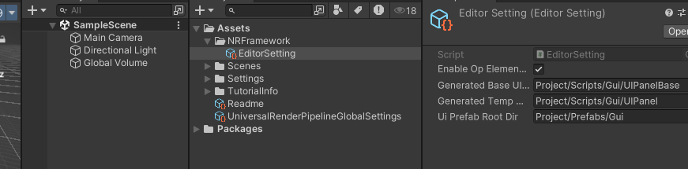

---

## 🗂️ 层级体系（UILayerConfig 可配置）

UI 层级是一份 **ScriptableObject**：`UILayerConfig`。放在使用方**某个 `Resources/` 目录**下、命名 `UILayerConfig.asset`。`Game.Init()` 与 UI 管理器都读它；**没配置就用内置默认 12 层**（与原框架完全一致，老工程无痛升级）。

### 约定（重要）
- `layers` 的**顺序 = 层级从低到高，下标就是「层级 id」**。业务里的 `uiRoots[id]`、生成的 `xxx_UIlayer` 常量都用这个下标。
- 每层 order 区间必须**递增、不重叠**。
- 每层字段：`name`（英文层名，不带下划线）/ `startOrder` / `endOrder` / `displayName`（编辑器里显示的中文名）/ `color`（编辑器色条 / chip 颜色）。

### 怎么配
1. **一键生成（推荐）**：菜单 `Tools ▸ NRFramework ▸ 创建 UILayerConfig`，自动在 `Assets/Resources/` 下生成一份**带默认 12 层**的 `UILayerConfig.asset`（已存在则不覆盖）。
2. 选中它，在 Inspector 里按需增 / 减 / 改层。（也可手动 `Assets ▸ Create ▸ NRFramework ▸ UILayerConfig` 建一份空的，再点右上角「⋮ ▸ 填入默认 12 层」。）
3. 增 / 减层建议**在末尾操作**（下标稳定，不会打乱已有界面的层级 id 和已生成常量）；改完到 UI 管理器点「🔄 刷新层级」同步。

> ⚠ **只推荐末尾增减层**。在中间插 / 删层会让后面所有层的下标（= 层级 id）整体错位，且值没越界时检测不到——需要重排界面层级并重新生成常量。层级是架构级配置，建议项目早期一次定好。

### 默认 12 层

| 层级 | id（下标） | 用途 | sortingOrder 段 |
|---|---|---|---|
| WorldScene | 0 | 场景UI：地图标记、地面特效 | 0–49 |
| WorldObject | 1 | 物体UI：血条、名字、NPC标识 | 50–99 |
| WorldEffect | 2 | 特效UI：伤害数字、BUFF图标 | 100–149 |
| DragLayer | 3 | 拖拽层 | 150–199 |
| MainLayer | 4 | 主界面 HUD | 200–249 |
| ScreenLayer | 5 | 全屏功能界面 | 250–349 |
| ModalLayer | 6 | 模态对话框 | 350–449 |
| PopLayer | 7 | 普通弹窗 | 450–549 |
| GuideLayer | 8 | 新手引导 | 550–649 |
| TopLayer | 9 | 飘字/公告 | 650–749 |
| LoadingLayer | 10 | 加载界面 | 750–849 |
| CursorLayer | 11 | 鼠标/手势 | 850–949 |

> 同层内多个面板会自动按 sortingOrder 递增叠放，无需手填。

---

## 🛠️ UI 管理器编辑器 · 详细用法

一个可视化面板：**扫描所有 UI 预制体 → 配层级 → 生成路径常量**，并对每个界面做**批次/内存/RaycastTarget 体检**，帮你日常管理和优化 UI。

### 打开
菜单栏 **Tools ▸ UI管理器**。首次打开会自动加载已存配置(或自动扫描)。

> 📸 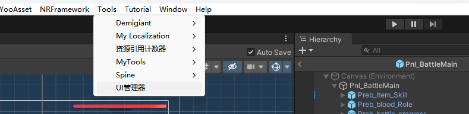

---

### 一、界面分区总览
从上到下：**工具栏 → (设置面板) → 统计栏 → 待确认区 → 层级列表 → 底部按钮**。

> 📸 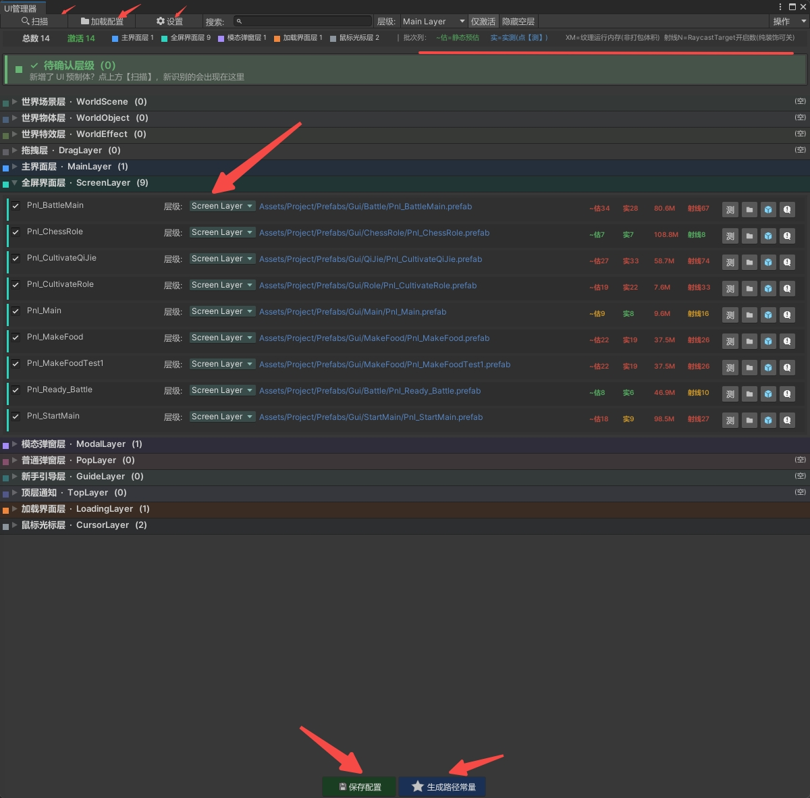

---

### 二、顶部工具栏
| 按钮 | 作用 |
|---|---|
| 🔍 **扫描** | 扫描配置路径下所有带 `UIPanelBehaviour` 的预制体，自动识别层级，带进度条，完成弹窗 |
| 📂 **加载配置** | 重新读取已存的 UIConfig（手动点会浮层提示"已加载 N 个"）|
| 🔄 **刷新层级** | 重新读 `UILayerConfig`（改了层级配置后点它同步）；把层级被删 / 越界的界面丢回**待确认区**重认，避免生成常量时引用到不存在的层 |
| ⚙ **设置** | 展开/收起"扫描路径设置"面板（选中时蓝底高亮）|
| 🔎 **搜索** | 按名称/路径过滤 |
| **层级:** 开关 + 下拉 | 勾上后只显示选中的那一层 |
| **仅激活** | 只显示勾了激活的项 |
| **隐藏空层** | 收起没有内容的层，列表更聚焦 |
| 📋 **操作** | 下拉菜单：全部激活/全部禁用/重置层级/自动排序/展开所有层 |

---

### 三、设置面板（点"设置"展开）
- **扫描路径**：可加多条(`+ 添加扫描路径`)、删除(🗑 红按钮)、从文件夹选择、保存、恢复默认。
- 改完点 **保存路径设置**。

> 📸 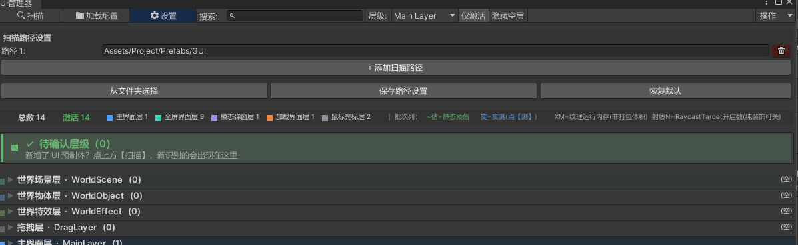

---

### 四、统计栏
- **总数 / 激活**(绿色) 数量。
- **彩色层级 chip**：每个非空层一个带色胶囊，**点击即筛选只看该层**。
- **图例**：`~估=静态预估  实=实测  XM=纹理运行内存  射线N=RaycastTarget开启数`。
- **▶ 当前帧总批次**(仅 Play 模式)：整个 Game 视图实时批次，实测的参考基准。

> 📸 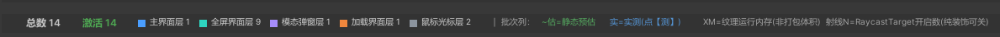

---

### 五、待确认区（橙色/绿色，常驻顶部）
- **有新识别的界面时**(橙色 ⚠)：列出自动识别层级、还没人工确认的界面。
  - 点每行的绿色 **✓** 确认（层级猜对了），或**改层级下拉**（自动算确认）→ 移入正式层级分组。
- **没有待确认时**(绿色 ✓)：显示引导语"新增了 UI 预制体？点上方【扫描】刷新识别"——提醒你加了预制体就来扫。

> 📸 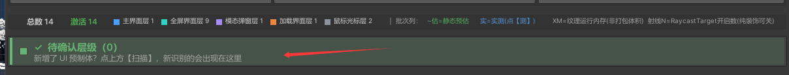
> 📸 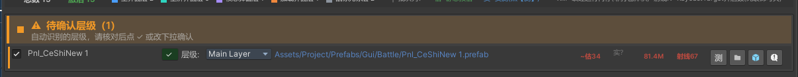

---

### 六、每行元素详解
一行 = 一个 UI 预制体：

| 元素 | 说明 |
|---|---|
| ☑ 勾选 | 是否**激活**(参与生成常量)；未激活整行置灰 |
| **名称**(可点) | 点一下在 Project 里选中定位；悬停看层级/路径 |
| **左侧色条** | 该行所属层级的主题色（待确认=橙色）|
| **层级** 下拉 | 改这个界面的层级(染层级色)|
| **路径**(淡蓝) | 可**鼠标划选 → Ctrl+C 复制** |
| `~估N` / `实N` | **预估批次 / 运行时实测批次**(红绿灯着色，悬停看构成) |
| `X.XM` | **纹理运行内存**(红绿灯) |
| `射线N` | **RaycastTarget 开启数**(红绿灯) |
| **测** | Play 模式下实测该界面真实批次 |
| 📁 / 🧊 / 🔍 | 系统文件夹定位 / 打开预制体编辑 / Project 选中 |

> 📸 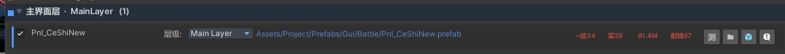

---

### 七、体检三指标（怎么看、怎么优化）
| 指标 | 含义 | 红绿灯 | 优化手段 |
|---|---|---|---|
| **批次(估/实)** | 合批后的 DrawCall | ≤8绿 / ≤16黄 / >16红 | 打图集、关多余 RaycastTarget、避免图集交错 |
| **内存 (XM)** | 依赖纹理运行内存(RAM,非打包体积) | <2M绿 / <6M黄 / ≥6M红 | 压缩格式(ASTC/ETC2)、降分辨率、关 Mipmap |
| **射线 (N)** | RaycastTarget 开启的图形数 | ≤8绿 / ≤20黄 / >20红 | 纯装饰/不点击的取消勾选 Raycast Target |

> 说明：**批次估/内存/射线** 都是**静态算、不用打包**；只有 `实N`(实测批次) 需要 Play 模式。

---

### 八、实测真实批次（Play 模式）
1. **进入 Play 模式(▶)**（建议在一个尽量空的场景里，数值最纯净）。
2. 点某行蓝色 **测** 按钮。
3. 工具临时生成该预制体、渲染几帧、读 `UnityStats.batches` 差值 → 写回 `实N`，并浮层提示。

> 注意：实测是"该界面单独、默认内容"的批次，是横向对比基准；真实上下文的批次可对着"▶ 当前帧总批次"手动读差值。

> 📸 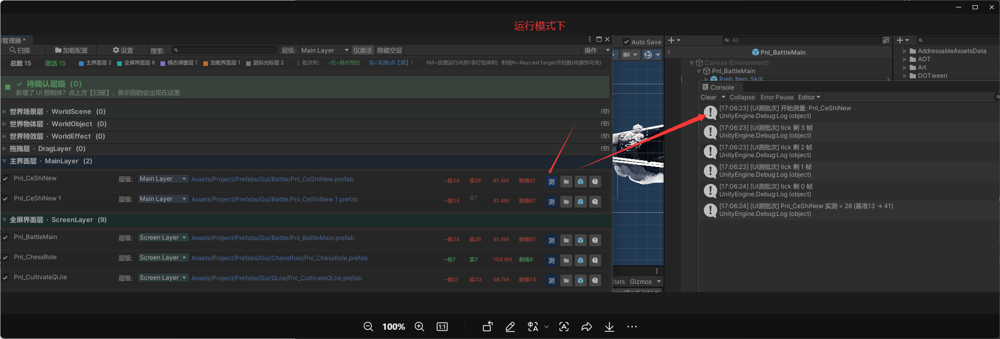

---

### 九、生成路径常量
核对好层级后：
1. 点底部 **保存配置**(浮层提示已保存；有未保存改动时标题会显示 `UI管理器 *`)。
2. 点 **生成路径常量** → 生成 `Assets/Resources/UIPath.cs`(`UIPathConstants` 类)。
   - **会先做重名校验**：若有同名预制体(会导致常量类编译报错)，弹窗列出并中止，先改名再生成。
   - **先执行 1 再执行 2**。

> 📸 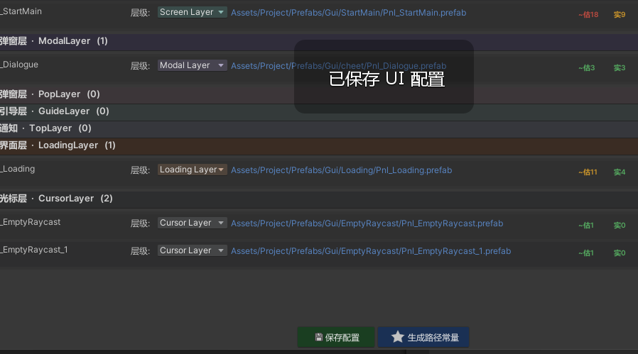
> 📸 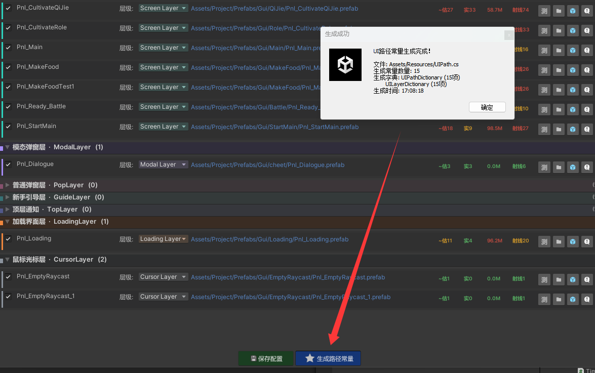

## 🔑 生成的路径常量（UIPathConstants）

编辑器"生成路径常量"后，每个界面得到两个常量，直接喂给 `CreatePanelAsync`：

```csharp
// 生成物示例
public const string Pnl_Main_UIPanel = "Assets/Project/Prefabs/Gui/Main/Pnl_Main.prefab";
public const int    Pnl_Main_UIlayer = 4;   // MainLayer

// 用法：路径 + 层级 一起用，零手写字符串；异步回调拿实例
Game.Instance.uiRoots[UIPathConstants.Pnl_Main_UIlayer].uI
    .CreatePanelAsync<Pnl_Main_Temp>(UIPathConstants.Pnl_Main_UIPanel, (ok, panel) =>
    {
        if (!ok) return;
        // panel 已创建并绑好组件，这里做初始化
    });
```
还生成 `UIPathDictionary` / `UILayerDictionary` 供按名查。

---
---

### 十、常见问题
- **关窗口提示"有未保存改动"**：你改了层级/激活没点保存，选保存即可。
- **改了 `UILayerConfig` 后编辑器没变**：到 UI 管理器点 **🔄 刷新层级** 重新读配置。
- **编译报 `Graphic/Image/Canvas` 找不到**：给 `NRFramework.Editor.asmdef` 加 `UnityEngine.UI` 引用。
- **内存别相加**：共享图集会各行重复计，是运行内存参考、非打包体积。

## ⚠ 接入约定：GGame 启动预制体（Init 前必看）

框架启动时 `UIManager` 会 `Resources.Load<GameObject>("GGame")` 加载一个**启动预制体 `GGame`**，里面含 UI 根画布、UI 相机等；`Game.Instance.Init()` 依赖它。

**三个硬约束（这三个"名字"不能动，改了框架就找不到 UI 根、跑不起来）：**

| 名字 | 框架怎么用 | 约束 |
|---|---|---|
| `GGame` | `Resources.Load<GameObject>("GGame")` | 预制体必须叫 `GGame`，且放在**某个 `Resources/` 目录**下 |
| `UICanvas` | 从 GGame 实例的子树里按名找（不全局搜） | GGame 里的画布 GameObject 必须叫 `UICanvas`（GGame 内唯一即可） |
| `UICamera` | 从 GGame 实例的子树里按名找（不全局搜） | GGame 里的相机 GameObject 必须叫 `UICamera`（GGame 内唯一即可） |

**除这三个名字外，GGame 随便改** —— 往里拖加载/进度条界面、改布局、加子物体、别人扩展结构，都不影响框架。

**GGame 不随包**（归你项目维护），但框架给了**一键生成**。引入本包后你项目里得有一份 `Assets/Resources/GGame.prefab`，否则启动 `Resources.Load("GGame")` 找不到、UI 起不来。步骤：
1. **一键生成**：菜单 `Tools ▸ NRFramework ▸ 创建 GGame`，自动把包内模板拷到你项目的 `Assets/Resources/GGame.prefab`。
2. **改成你要的**：往生成出来的 GGame 里拖加载 / 进度条界面、改布局、加子物体 —— 它是你自己的资源，随便改。
3. **守住三个名字**（见上表）：`GGame` / `UICanvas` / `UICamera` 不能改，其余随便。
4. 将来接入 **YooAsset** 后，可改由 YooAsset 按地址加载。

---

## 🔌 换资源加载器（接 YooAsset / Addressables）

框架加载 panel/widget 预制体走 **`IUIResLoader` 接口（唯一入口，全异步）**。默认 `DefaultUIResLoader` 在编辑器用 `AssetDatabase` **同步加载 + 立即回调**（开箱即用，开发期无感）；**打包运行时必须换成你的加载器**，否则会打印错误、加载不到 UI。

接口只有两个方法：
```csharp
public interface IUIResLoader
{
    // 按 path 异步加载预制体，完成回调 onLoaded(prefab)；失败回调 null。
    // path 语义由实现决定：AssetDatabase=资产路径 / YooAsset=地址 / Resources=相对路径。
    void LoadPrefabAsync(string path, Action<GameObject> onLoaded);

    // 释放（YooAsset 等按 handle 释放；Resources / AssetDatabase 版空实现即可）
    void ReleasePrefab(string path);
}
```

实现接口 + 启动前注入一行即可，**不用改框架源码**：
```csharp
using System;
using UnityEngine;
using NRFramework;

public class YooUIResLoader : IUIResLoader
{
    public void LoadPrefabAsync(string path, Action<GameObject> onLoaded)
    {
        var handle = YooAssets.LoadAssetAsync<GameObject>(path);
        handle.Completed += h => onLoaded?.Invoke(h.AssetObject as GameObject);
    }

    public void ReleasePrefab(string path) { /* 你的 handle 释放逻辑 */ }
}

// 启动入口，Init 之前注入：
UIRes.Loader = new YooUIResLoader();
Game.Instance.Init();
```
> `path` 就是你 `UIPathConstants` 里的路径/地址 —— 怎么解释由你的 loader 定（YooAsset 地址 / Resources 相对路径都行）。
> GGame 启动预制体是单独用 `Resources.Load("GGame")` 加载的（见「GGame 约定」），是启动地基、**不走这个 loader**。

---

## 🚀 快速开始

> **接入前置（各做一次）**：菜单 `Tools ▸ NRFramework` 一键生成两份开箱资源到 `Assets/Resources/` —— **创建 GGame**（启动预制体，含 UICanvas / UICamera，见「GGame 约定」）+ **创建 UILayerConfig**（层级配置，默认 12 层，见「层级体系」）。都是你自己的资源、可随便改。

### 1. 初始化框架（启动时调一次）
```csharp
using NRFramework;       // UIRes / IUIResLoader / Game（已统一到 NRFramework，一个 using 全搞定）

void Start()   // 游戏启动入口，这几步的顺序很重要
{
    // ① 用 YooAsset / Addressables 时：先确保它自己初始化完、资源包就绪
    //    （用 Resources / 编辑器 AssetDatabase 直接跳过这步）
    // await InitYooAsset();

    // ② 注入资源加载器（不写 = 默认编辑器 AssetDatabase，编辑器测试够用；
    //    打包 or 换 YooAsset 必须设，写法见上方「换资源加载器」节）
    // UIRes.Loader = new YourUIResLoader();

    // ③ 初始化 UI 框架：出 GGame 地基（Resources.Load）+ 读 UILayerConfig 建各层 UIRoot
    Game.Instance.Init();

    // ④ 之后即可开面板（见「2. 打开一个面板」）
}
```
> **顺序要点**：`UIRes.Loader` 要在**第一次开面板之前**设好（放 `Init()` 前最省心）；用 YooAsset 还要**先确保 YooAsset 自身已初始化**。GGame 是启动地基，`Init` 里固定走 `Resources.Load`、不受 loader 影响。

### 2. 打开一个面板（异步回调）
```csharp
// 取对应层级的 UIRoot（层级值用生成的 UIPath 常量）
var root = Game.Instance.uiRoots[UIPathConstants.Pnl_Main_UIlayer].uI;

// 异步创建：泛型=面板逻辑类，参数=预制体路径 + 完成回调 (bool 成功, 面板实例)
root.CreatePanelAsync<Pnl_Main_Temp>(UIPathConstants.Pnl_Main_UIPanel, (ok, panel) =>
{
    if (!ok || panel == null) return;   // 加载失败（如没注入 loader）直接返回
    // panel 已创建、组件已绑好，这里做初始化
});
```
> 面板加载是**异步**的，实例只在回调里拿得到 —— 想拿到 `panel` 后立刻 `Init(...)` 的，把逻辑写进回调。
> 需要指定 panelId / sortingOrder 的，用重载：`CreatePanelAsync<T>(panelId, path, sortingOrder, (ok, panel) => {})`。

### 3. 关闭 / 显隐面板（同步）
```csharp
root.ClosePanel<Pnl_Main_Temp>();            // 关闭(隐藏并清理)
root.DestroyPanel<Pnl_Main_Temp>();          // 彻底销毁
root.SetPanelVisible<Pnl_Main_Temp>(false);  // 只隐藏不销毁
```

### 4. 封装一个好用的开面板方法（异步回调版）
```csharp
// 结合本地 UI 编辑器生成的 UIPathConstants，按类型名自动取层级 + 路径。
// 加载是异步的，所以封装也走回调：拿到 panel 后在回调里 Init。
public static void OpenUI_Local<T>(Action<T> onCreated = null) where T : UIPanel
{
    var csName = typeof(T).Name;
    string result = csName.Replace("_Temp", "");
    int panelType = (int)UIPathConstants.UILayerDictionary[result];
    var uiroot = Game.Instance.uiRoots[panelType];
    var path = UIPathConstants.UIPathDictionary[result];

    uiroot.uI.CreatePanelAsync<T>(csName, path, (ok, panel) =>
    {
        if (!ok || panel == null) return;
        panel.gameObject.transform.SetParent(uiroot.obj.transform);
        onCreated?.Invoke(panel);
    });
}

// 调用：
OpenUI_Local<Pnl_Main_Temp>(p => p.Init(/* ... */));
```
> （也可以走 Luban 配表拿层级 / 路径，思路一样，把 `CreatePanel` 换成 `CreatePanelAsync` 的回调写法即可。）

---

## 🖼️ 制作一个界面（完整流程）

### 第 1 步：做预制体 + 挂行为脚本
- 用 UGUI 拼好界面预制体。
- 根节点挂 **`UIPanelBehaviour`**（Widget 用 `UIWidgetBehaviour`）。

### 第 2 步：标记要绑定的节点
- 选中要在代码里用的节点（按钮/文本/图片…）→ 右键 **`SetAsUIOpElement`** 标记为操作元素。
- 取消标记用 `RemoveUIOpElement`。

### 第 3 步：生成 Base 代码
- 在 `UIPanelBehaviour` 的 Inspector 上点 **生成/导出 Base**，会生成 `Xxx_Base` 类，
  自动把标记的节点绑成 `m_XXX` 字段、并在 `OnBindCompsAndEvents` 里连好事件。

### 第 4 步：写面板逻辑类（继承 Base）
```csharp
public class Pnl_Main_Temp : Pnl_MainBase
{
    protected override void OnCreated()
    {
        // 初始化：m_ 字段已绑好，直接用
        m_Txt_Title_Text.text = "主界面";
    }

    protected override void OnClicked(Button button)
    {
        if (button == m_Btn_Start_Button) { /* 点了开始 */ }
    }

    protected override void OnDestroying() { /* 清理 */ }
}
```

### 第 5 步：打开它（异步回调）
```csharp
Game.Instance.uiRoots[UIPathConstants.Pnl_Main_UIlayer].uI
    .CreatePanelAsync<Pnl_Main_Temp>(UIPathConstants.Pnl_Main_UIPanel, (ok, panel) =>
    {
        if (ok) { /* panel 就绪 */ }
    });
```

> 📸 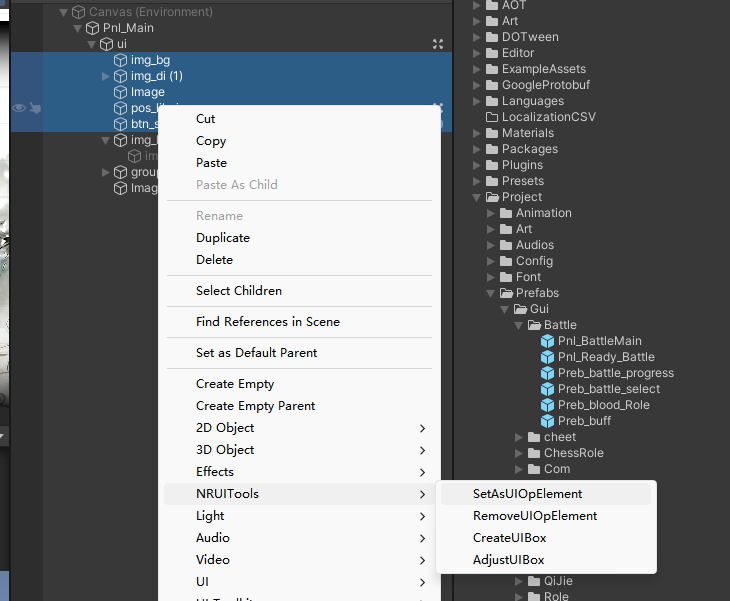
> 📸 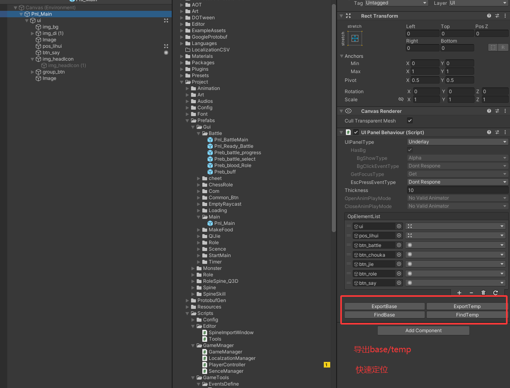

---

## 🧱 Widget 用法（异步加载 vs 现成对象）

Widget 是"界面里的可复用子模块"（如一个道具格子、一条列表项）。按**要不要加载预制体**分两类：

### 一、传路径 → 异步加载（回调式）
需要从磁盘 / YooAsset 加载预制体的，走 `...Async`，实例在回调里拿：
```csharp
// A. 加载一个 Widget 预制体挂到某父节点下
CreateWidgetAsync<Wdg_Popup_Temp>(parentTransform, "Assets/.../Wdg_Popup.prefab", (ok, w) =>
{
    if (ok) w.Setup(/* ... */);
});

// B. 加载模板并克隆（列表项最常用）
for (int i = 0; i < dataList.Count; i++)
{
    var data = dataList[i];
    CloneWidgetAsync<Preb_Item_Temp>("Item_" + i, contentTrans, itemPath, (ok, item) =>
    {
        if (ok) item.Setup(data);
    });
}
```

### 二、传现成对象（UIWidgetBehaviour）→ 同步返回
预制体里**本来就有的节点** / **已在手上的模板对象**，不涉及加载，仍是同步、直接返回：
```csharp
// A. 把界面里已有的一个节点包成 Widget（不复制）
var header = CreateWidget<Wdg_Header_Temp>(m_Header_UIWidgetBehaviour);

// B. 从一个现成模板 behaviour 克隆一份
var item = CloneWidget<Preb_Item_Temp>(contentTrans, m_Preb_Item_UIWidgetBehaviour);
```

**一句话区别：**
- **传 `string path` = 异步加载**（用 `CreateWidgetAsync` / `CloneWidgetAsync`，回调 `Action<bool, T>` 拿实例）。
- **传 `UIWidgetBehaviour`（现成对象）= 同步**（用 `CreateWidget` / `CloneWidget`，直接返回 T）。
- `CreateWidget` = **包裹现有节点**，不复制；`CloneWidget` = **Instantiate 复制一份**（同一个模板做多个，如列表）。

### 销毁 Widget
```csharp
DestroyWidget("Item_3");        // 按 id
DestroyWidget<Wdg_Header_Temp>();
DestroyAllWidgets();            // 全清（面板销毁时自动调）
```


## 🔗 事件绑定
Base 类已自动 `BindEvent`，逻辑类里重写对应回调即可：
```csharp
protected override void OnClicked(Button button) { }
protected override void OnValueChanged(Toggle t, bool v) { }
protected override void OnValueChanged(Slider s, float v) { }
```
也可订阅全局事件：`UIView.onButtonClickedGlobalEvent += ...`。

---

## ♻️ 生命周期（Panel/Widget 通用）
```
Create → OnBindCompsAndEvents(自动绑) → OnCreating → OnCreated → OnStart → OnEnable
关闭：OnDestroying → OnUnbindCompsAndEvents → OnDestroyed（子 Widget 自动递归销毁）
```
- 初始化写 `OnCreated`；清理写 `OnDestroying`。
- 需要每帧：`OnAddUpdate(cb)` / `OnRemoveUpdate(cb)`。（有些特定需求确实需要 update，不会写进自动生成模板里，需要时手动调用：什么时候需要启动 update、什么时候需要关闭 update。90% 功能不需要，同时也提供了切出游戏 / 回到游戏的处理。）

---

## 🔁 从旧同步版升级（迁移指南）

1.0.11 起面板 / Widget 加载**全异步**，创建接口从"返回实例"改成"回调拿实例"。老工程按下表迁移使用方代码（框架源码不用动）：

| 旧（同步） | 新（异步回调） |
|---|---|
| `var p = root.CreatePanel<T>(path); p.Init();` | `root.CreatePanelAsync<T>(path, (ok, p) => { if (ok) p.Init(); });` |
| 加载 Widget：`CreateWidget<T>(parent, path)` | `CreateWidgetAsync<T>(parent, path, (ok, w) => {})` |
| 克隆加载：`CloneWidget<T>(id, parent, path)` | `CloneWidgetAsync<T>(id, parent, path, (ok, item) => {})` |
| loader：`GameObject LoadPrefab(string path)` | `void LoadPrefabAsync(string path, Action<GameObject> onLoaded)` |
| 层级写死在 `Game.cs` | 改一份 `UILayerConfig`(SO)，`Init` 自动读 |

**不用改**：`CreateWidget(behaviour)` / `CloneWidget(templateBehaviour)`（传现成对象、不加载）仍是同步；`ClosePanel` / `DestroyPanel` / `SetPanelVisible` / `GetPanel` 等也不变。

> 命名空间已统一到 `NRFramework`（`Game` / `UIRes` / `IUIResLoader` 一个 using 全含），旧代码若从 `NRFramework.UI` 引用 `Game` 报 CS0234，改成 `using NRFramework;` 即可。

---

## 📚 常用 API 速查

**UIRoot（管面板）**
| API | 说明 |
|---|---|
| `CreatePanelAsync<T>(path, (ok,panel)=>{})` | **异步**打开面板，回调拿实例 |
| `CreatePanelAsync<T>(panelId, path, sortingOrder, cb)` | 带 id / 指定 sortingOrder 的重载 |
| `ClosePanel<T>()` / `ClosePanel(id)` | 关闭 |
| `DestroyPanel<T>()` / `DestroyPanel(id)` | 销毁 |
| `SetPanelVisible<T>(bool)` | 显隐 |
| `GetPanel<T>()` / `GetPanel(id)` | 取面板实例 |
| `IsPanelOpened<T>()` / `ExistPanel<T>()` | 是否已开 |

**UIView（Panel/Widget 基类，管组件）**
| API | 说明 |
|---|---|
| `CreateWidgetAsync<T>(parent, path, cb)` | **异步**加载并包裹 Widget |
| `CloneWidgetAsync<T>(parent, path, cb)` | **异步**加载模板并克隆 |
| `CreateWidget<T>(behaviour)` | **同步**包裹现成节点 |
| `CloneWidget<T>(parent, templateBehaviour)` | **同步**克隆现成模板 |
| `DestroyWidget(id)` / `DestroyAllWidgets()` | 销毁 |
| `GetWidget<T>()` / `ExistWidget(id)` | 取/判断 |

---

## ❓ FAQ
- **为什么开面板变成回调了？** 1.0.11 起加载全异步（对接 YooAsset 的必然形态）。面板实例只在 `CreatePanelAsync` 的回调里拿得到，把初始化写进回调即可。
- **打包后 UI 打不开、报"未注入 UI 资源加载器"？** 默认加载器只在编辑器可用；打包前必须 `UIRes.Loader = new YourLoader();`（在 `Game.Init()` 之前）。
- **改了 `UILayerConfig` 编辑器/运行没生效？** 编辑器到 UI 管理器点 **🔄 刷新层级**；运行时确认 `UILayerConfig.asset` 在某个 `Resources/` 下且 `Init()` 读到了。
- **编译报 `Graphic/Image/Canvas` 找不到？** 给 `NRFramework.Editor.asmdef` 加 `UnityEngine.UI` 引用。
- **内存那列能相加吗？** 不能——共享图集会重复计；它是**运行内存**参考，非打包体积。
- **图集降的是啥？** 主要降**批次(DrawCall)**，不降运行内存；降内存靠压缩格式/分辨率/关 Mipmap。
